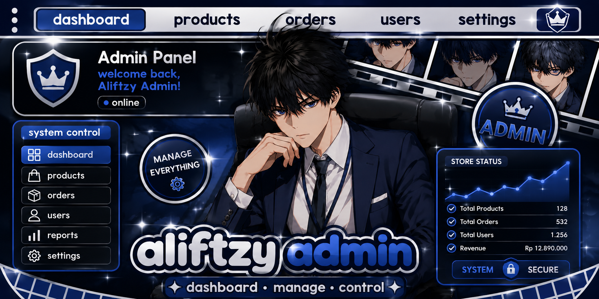
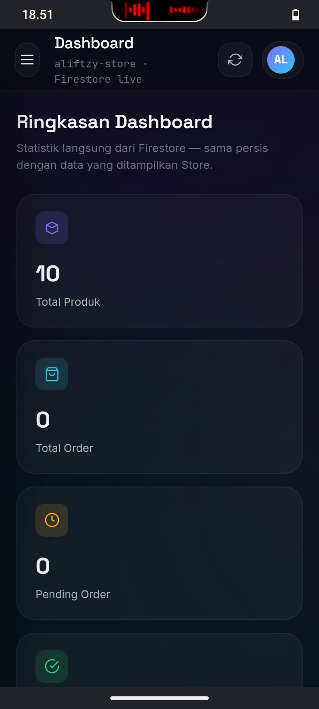
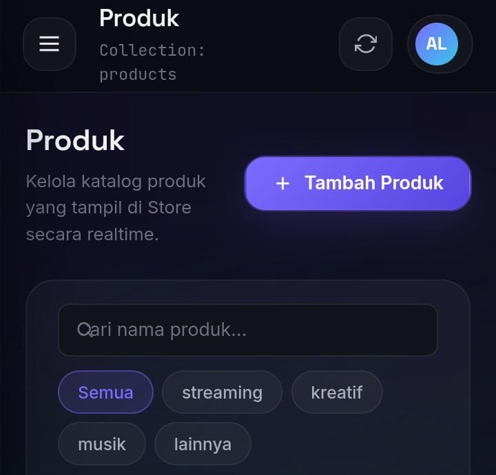
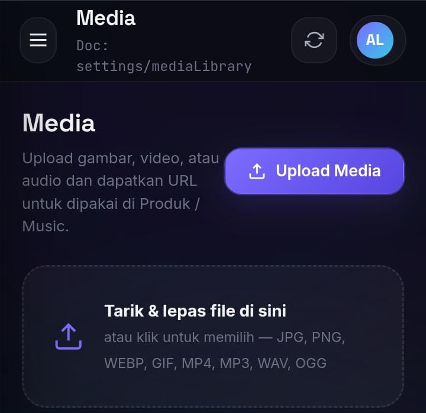
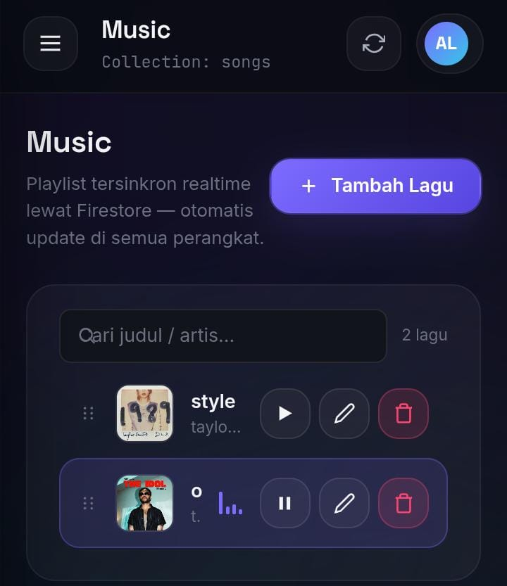
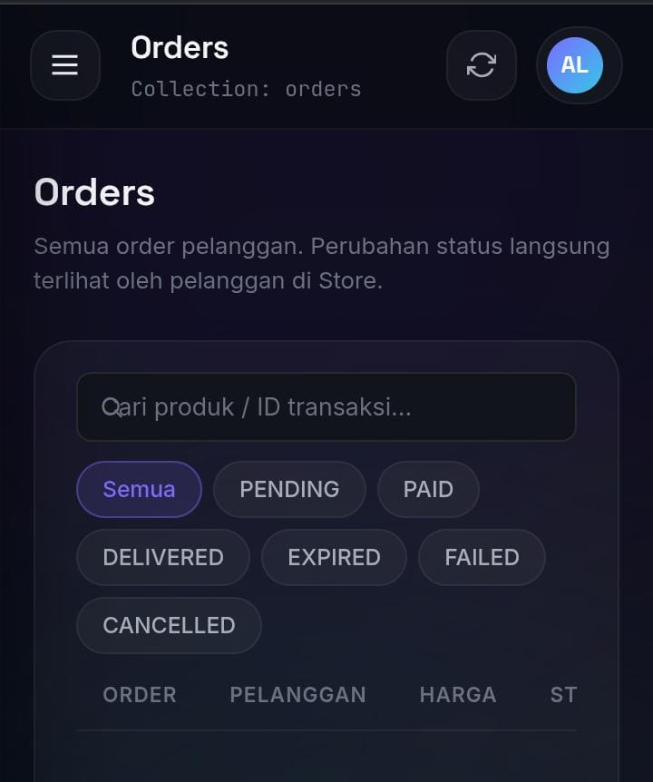
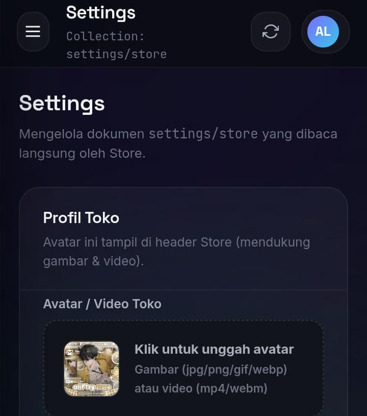

<div align="center">



<br><br>

# Aliftzy Admin

<strong>The control-plane dashboard for Aliftzy Store</strong><br>
A zero-build, Firebase-native admin panel written in vanilla JavaScript ES Modules.

<br>


<br><br>


</div>

<br>

<div align="center">

**[Overview](#overview)** · **[Features](#features)** · **[Screenshots](#screenshots)** · **[Technologies](#technologies)** · **[Project Structure](#project-structure)** · **[Database](#database)** · **[Security](#security)** · **[Deployment](#deployment)** · **[Developer](#developer)** · **[License](#license)**

</div>

<br>

---

<h2 id="overview">
&nbsp;
Overview
</h2>

**Aliftzy Admin** is the standalone administrative dashboard for **Aliftzy Store**, a Firebase-backed digital subscription storefront. It is built as a completely separate repository that reads and writes to the **exact same Firebase project** as the Store — no intermediary API, no data duplication, no separate backend.

Every change made in Aliftzy Admin is reflected in Aliftzy Store the moment the Store re-fetches data. The two codebases never touch: this repository does not alter a single line, collection, field, or security rule belonging to the Store.

Design principles behind this project:

<table>
<tr>
<td width="50%" valign="top">

**Zero build step**
Pure HTML, CSS, and JavaScript ES Modules. Firebase is imported directly from the `gstatic.com` CDN — no bundler, no transpiler, no `node_modules`.

</td>
<td width="50%" valign="top">

**Surgical compatibility**
Every new field or capability is additive. The Store's existing read paths, field names, and document shapes are never modified or removed.

</td>
</tr>
<tr>
<td width="50%" valign="top">

**Rules-first architecture**
The dashboard is designed *around* the production Firestore Security Rules — not the other way around. No new collections, subcollections, or rule changes are introduced.

</td>
<td width="50%" valign="top">

**Right tool per module**
Not everything needs a database — Products, Stock, Orders, Announcements, and Settings live in Firestore, while Music is a fully local, file-based library with no network dependency at all.

</td>
</tr>
</table>

<br>

---

<h2 id="features">
&nbsp;
Features
</h2>

<table>
<thead>
<tr>
<th align="left">Module</th>
<th align="left">Description</th>
<th align="center">Status</th>
</tr>
</thead>
<tbody>
<tr>
<td><strong>Dashboard</strong></td>
<td>Live stats — total products, orders, pending/paid orders, stock levels, estimated revenue, recent-orders feed, and status distribution.</td>
<td align="center"></td>
</tr>
<tr>
<td><strong>Products</strong></td>
<td>Full CRUD, multi-package pricing editor, category filtering, live search, and a real-time preview card that updates as you type.</td>
<td align="center"></td>
</tr>
<tr>
<td><strong>Media Manager</strong></td>
<td>Drag-and-drop upload for images, video, and audio with live progress, previews, one-click URL copy, and search/filter by type.</td>
<td align="center"></td>
</tr>
<tr>
<td><strong>Music</strong></td>
<td>A realtime playlist manager backed by Firestore (<code>songs</code> collection) — pick audio/cover files straight from the Media Manager or paste a URL, search, drag-to-reorder (synced instantly across every device), and a sticky mini player with play/pause, next/previous, shuffle, repeat, volume, and an animated equalizer.</td>
<td align="center"></td>
</tr>
<tr>
<td><strong>Stock</strong></td>
<td>Credential inventory per product (email / password / notes), availability toggling, and status + product filtering.</td>
<td align="center"></td>
</tr>
<tr>
<td><strong>Orders</strong></td>
<td>Search by product, transaction ID, or user; status filtering; manual status updates; automatic credential delivery from available Stock.</td>
<td align="center"></td>
</tr>
<tr>
<td><strong>Announcements</strong></td>
<td>CRUD for storefront banners — title, message, type (info / warning / update / important), and active/inactive toggling.</td>
<td align="center"></td>
</tr>
<tr>
<td><strong>Settings</strong></td>
<td>Store profile management — name, WhatsApp contact, description, and avatar/media upload.</td>
<td align="center"></td>
</tr>
<tr>
<td><strong>Profile</strong></td>
<td>Signed-in admin account details, password change, and logout.</td>
<td align="center"></td>
</tr>
<tr>
<td><strong>Keyboard Shortcuts</strong></td>
<td><kbd>Ctrl/⌘ S</kbd> save, <kbd>Ctrl/⌘ F</kbd> search, <kbd>Ctrl/⌘ N</kbd> new item, <kbd>Esc</kbd> close modal.</td>
<td align="center"></td>
</tr>
<tr>
<td><strong>Interface System</strong></td>
<td>Dark glassmorphism "Signal Room" theme, skeleton loading, toast notifications, confirmation dialogs, empty/error states, and a responsive collapsible sidebar.</td>
<td align="center"></td>
</tr>
</tbody>
</table>

<br>

---

<h2 id="screenshots">
&nbsp;
Screenshots
</h2>

<table>
<tr>
<td align="center" width="50%">
<br>
<sub><strong>Dashboard</strong> — live statistics &amp; order overview</sub>
</td>
<td align="center" width="50%">
<br>
<sub><strong>Products</strong> — catalog management &amp; live preview</sub>
</td>
</tr>
<tr>
<td align="center" width="50%">
<br>
<sub><strong>Media</strong> — drag-and-drop upload manager</sub>
</td>
<td align="center" width="50%">
<br>
<sub><strong>Music</strong> — local library &amp; mini player</sub>
</td>
</tr>
<tr>
<td align="center" width="50%">
<br>
<sub><strong>Orders</strong> — order management &amp; delivery</sub>
</td>
<td align="center" width="50%">
<br>
<sub><strong>Settings</strong> — store profile configuration</sub>
</td>
</tr>
</table>

<br>

---

<h2 id="technologies">
&nbsp;
Technologies
</h2>

<div align="center">

<table>
<tr>
<td align="center" width="120">
<br><sub><strong>HTML5</strong></sub>
</td>
<td align="center" width="120">
<br><sub><strong>CSS3</strong></sub>
</td>
<td align="center" width="120">
<br><sub><strong>JavaScript</strong></sub>
</td>
<td align="center" width="120">
<br><sub><strong>Firebase Auth</strong></sub>
</td>
<td align="center" width="120">
<br><sub><strong>Firestore</strong></sub>
</td>
</tr>
<tr>
<td align="center" width="120">
<br><sub><strong>Git</strong></sub>
</td>
<td align="center" width="120">
<br><sub><strong>GitHub</strong></sub>
</td>
<td align="center" width="120">
<br><sub><strong>Vercel</strong></sub>
</td>
<td align="center" width="120">
<br><sub><strong>Netlify</strong></sub>
</td>
<td align="center" width="120">
<br><sub><strong>Web SDK v10</strong></sub>
</td>
</tr>
</table>

</div>

> This project intentionally ships **without a bundler**. Firebase is loaded straight from the `gstatic.com` CDN, matching the exact technical pattern used by Aliftzy Store, so both codebases can be deployed to any static host with zero configuration.

<br>

---

<h2 id="project-structure">
&nbsp;
Project Structure
</h2>

```text
Aliftzy-Admin/
├── index.html                  # Login screen + app shell + router outlet
├── firestore.rules             # Reference copy of production rules (never deployed from here)
├── package.json
│
├── css/
│   ├── tokens.css              # Design tokens — color, type scale, radius, motion
│   ├── base.css                # Reset & base typography
│   ├── layout.css              # Sidebar, topbar, shell, auth screen
│   ├── components.css          # Buttons, cards, tables, modals, toasts, forms, badges
│   ├── animations.css          # Page transitions, stagger effects, reduced-motion
│   └── pages.css                # Per-page layout (Media grid, Music player, previews)
│
└── js/
    ├── firebase-config.js      # Identical to Aliftzy-Store's Firebase project config
    ├── router.js                # Lightweight hash router (#/dashboard, #/products, ...)
    ├── app.js                   # Entry point — auth flow, shell wiring, keyboard shortcuts
    │
    ├── utils/
    │   ├── format.js             # Currency, date, string, byte-size, and ID helpers
    │   └── dom.js                 # DOM query & file-reading helpers
    │
    ├── services/                # One file = one Firestore collection (or document)
    │   ├── authService.js
    │   ├── productsService.js
    │   ├── stockService.js
    │   ├── ordersService.js
    │   ├── musicService.js        # songs collection — realtime, ordered by `order` asc
    │   ├── announcementsService.js
    │   ├── settingsService.js
    │   ├── statsService.js
    │   ├── mediaService.js        # Media library metadata → settings/mediaLibrary
    │   └── uploadService.js       # Browser-side transport for the media upload API
    │
    ├── components/               # Reusable UI — no markup duplication across pages
    │   ├── sidebar.js
    │   ├── topbar.js
    │   ├── modal.js
    │   ├── confirmDialog.js
    │   ├── toast.js
    │   ├── skeleton.js
    │   └── state.js                # Empty / error state blocks
    │
    └── pages/                    # One file = one dashboard route
        ├── dashboard.js
        ├── products.js
        ├── stock.js
        ├── orders.js
        ├── songs.js                # "Music" route — Firestore-backed playlist manager
        ├── media.js
        ├── announcements.js
        ├── settings.js
        └── profile.js
```

<br>

---

<h2 id="database">
&nbsp;
Database
</h2>

Aliftzy Admin and Aliftzy Store share **one Firestore database** inside the same Firebase project. There is no API layer between them — both read and write Firestore directly, so changes propagate as soon as the other side re-fetches.

<table>
<thead>
<tr>
<th align="left">Collection / Document</th>
<th align="left">Read by Store via</th>
<th align="left">Fields Store consumes</th>
<th align="left">Written by</th>
</tr>
</thead>
<tbody>
<tr><td><code>products</code></td><td><code>loadProducts()</code></td><td><code>name, category, price, desc, badge, img, link, packages[]</code></td><td><code>productsService.js</code></td></tr>
<tr><td><code>songs</code></td><td><code>loadSongs()</code></td><td><code>title, artist, url</code></td><td><code>musicService.js</code></td></tr>
<tr><td><code>stock</code></td><td><code>loadStockPublic()</code></td><td><code>productId, sold</code></td><td><code>stockService.js</code></td></tr>
<tr><td><code>announcements</code></td><td><code>loadAnnouncements()</code></td><td><code>title, msg, type, active, createdAt</code> (epoch ms)</td><td><code>announcementsService.js</code></td></tr>
<tr><td><code>settings/store</code></td><td><code>loadStoreProfile()</code></td><td><code>avatarUrl</code></td><td><code>settingsService.js</code></td></tr>
<tr><td><code>orders</code></td><td><code>loadMyOrders()</code></td><td><code>productName, price, status, createdAt, delivered*</code></td><td><code>ordersService.js</code> (update only)</td></tr>
<tr><td><code>settings/mediaLibrary</code></td><td><em>Admin-only</em></td><td>—</td><td><code>mediaService.js</code></td></tr>
</tbody>
</table>

<blockquote>

**No new collections. No new subcollections.** The `songs` documents Admin writes now carry a richer shape — `title, artist, audioUrl, url, coverUrl, duration, order, createdAt, updatedAt` — but `url` is always kept mirroring `audioUrl`, so the Store's existing `loadSongs()` (which only reads `title, artist, url`) keeps working completely unmodified. Every other additive field (e.g. `stock.label`) follows the same rule: the Store ignores fields it doesn't know about, so backward compatibility is guaranteed by design, not by convention.

</blockquote>

<br>

---

<h2 id="security">
&nbsp;
Security
</h2>

<table>
<tr>
<td width="28"></td>
<td><strong>Authentication</strong><br>Firebase Authentication (email &amp; password), pointed at the same project as the Store. No parallel identity system.</td>
</tr>
<tr>
<td width="28"></td>
<td><strong>Firestore Rules</strong><br>Admin status is resolved by <code>request.auth.token.email</code> via an <code>isAdmin()</code> rule function — never hardcoded on the client. The dashboard verifies admin access by attempting to read <code>settings/adminConfig</code>, a document the rules already gate behind <code>isAdmin()</code>. A denied read immediately signs the session out.</td>
</tr>
<tr>
<td width="28"></td>
<td><strong>Realtime Sync</strong><br>No intermediary API or webhook queue — Admin and Store read/write the same Firestore instance directly, so state is always consistent.</td>
</tr>
<tr>
<td width="28"></td>
<td><strong>Repository Separation</strong><br>Aliftzy Admin is a fully independent repository. It has never modified a line of code, a field, or a rule inside Aliftzy Store.</td>
</tr>
<tr>
<td width="28"></td>
<td><strong>Ownership Validation</strong><br>Order documents are gated with <code>isOwner(resource.data.userId)</code> — a customer can only ever read their own orders; only an admin can update or delete them.</td>
</tr>
<tr>
<td width="28"></td>
<td><strong>Realtime Ownership</strong><br>Song documents live in the same <code>isAdmin()</code>-gated <code>songs</code> collection the Store already reads publicly — writes (add/edit/delete/reorder) still require an authenticated admin.</td>
</tr>
</table>

<br>

---

<h2 id="deployment">
&nbsp;
Deployment
</h2>

Because there is no build step, Aliftzy Admin can be deployed to **any static host**.

<table>
<thead>
<tr><th align="left">Step</th><th align="left">Command / Action</th></tr>
</thead>
<tbody>
<tr><td>1&nbsp;·&nbsp;Clone</td><td><code>git clone &lt;repository-url&gt;</code></td></tr>
<tr><td>2&nbsp;·&nbsp;Run locally</td><td><code>npx serve .</code> &nbsp;or&nbsp; <code>python3 -m http.server</code></td></tr>
<tr><td>3&nbsp;·&nbsp;Deploy</td><td>Upload the repository as-is to Vercel, Netlify, Firebase Hosting, or GitHub Pages</td></tr>
<tr><td>4&nbsp;·&nbsp;Authorize domain</td><td>Add the deployed domain under <em>Firebase Console → Authentication → Settings → Authorized domains</em></td></tr>
<tr><td>5&nbsp;·&nbsp;Sign in</td><td>Log in with the Firebase account whose email matches <code>isAdmin()</code> in the production rules</td></tr>
</tbody>
</table>

> Firestore Security Rules are **never deployed from this repository**. The `firestore.rules` file here is a reference copy for documentation only — rule changes are always deployed manually via the Firebase Console or CLI.

<br>

---

<h2 id="developer">
&nbsp;
Developer
</h2>

<table>
<tr>
<td width="160" valign="top">

</td>
<td valign="top">

### Tuan Aliff
**Creator &amp; Maintainer — Aliftzy Store &amp; Aliftzy Admin**

Builds and maintains both the customer-facing storefront and this administrative dashboard as a matched pair of repositories sharing one Firebase project — favoring small, surgical, verifiable changes over large rewrites.

<br>

**Stack focus**


</td>
</tr>
</table>

<br>

---

<h2 id="project-information">
&nbsp;
Project Information
</h2>

<table>
<tr><td><strong>Project</strong></td><td>Aliftzy Admin</td></tr>
<tr><td><strong>Companion Project</strong></td><td>Aliftzy Store</td></tr>
<tr><td><strong>Version</strong></td><td>1.0.0</td></tr>
<tr><td><strong>Architecture</strong></td><td>Static site — vanilla JavaScript ES Modules + Firebase Web SDK v10 (CDN)</td></tr>
<tr><td><strong>Build Tooling</strong></td><td>None — no bundler, no framework</td></tr>
<tr><td><strong>Developer</strong></td><td>Tuan Aliff</td></tr>
</table>

<br>

---

<h2 id="license">
&nbsp;
License
</h2>

This project is **proprietary and closed-source**. All rights are reserved by the developer.

No portion of this repository — code, design system, or assets — may be copied, redistributed, or used in another project without explicit written permission.

<br>

---

<div align="center">

<br>

### Aliftzy Admin

<sub>Version 1.0.0 · Built by <strong>Tuan Aliff</strong></sub>

<br><br>

&nbsp;
<sub>Powered by Firebase &amp; Firestore</sub>

<br><br>

<sub>© 2026 Aliftzy. All rights reserved.</sub>

</div>
